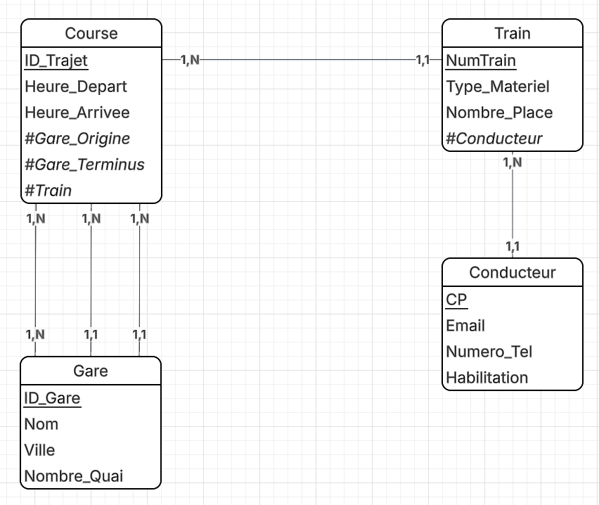

# Projet Simulation d'une infrastructure féroviaire

Ce projet de simulation de gares a été réalisé dans le cadre d'un projet de fin de module en informatique. L'objectif était de créer une application capable de simuler l'arrivée et le départ des trains, la gestion des quais et des horaires, ainsi que l'affichage en temps réel de l'état de la gare.

## Fonctionnalités

- Gestion des trains : ajout, suppression, modification des trains et de leurs horaires.
- Obtention en temps réel : de l'état de la gare, des trains en temps réel et des horaires
- Notifications : envoi de notifications au passage des trains en gare

## Membres de l'équipe

- ROBERT Gweltaz
- LETERTRE Félix 
- MERIT Juliann

## Technologies utilisées

- Langage de programmation : Spring Boot
- Base de données : H2
- Outils de développement : Maven
- Tests : JUnit
- Gestion de version : Github
- Documentation : Swagger
- API REST : Spring Web
- Validation : Spring Validation
- ORM : Spring Data JPA
- (Messaging : Spring Kafka)

## BDD 

